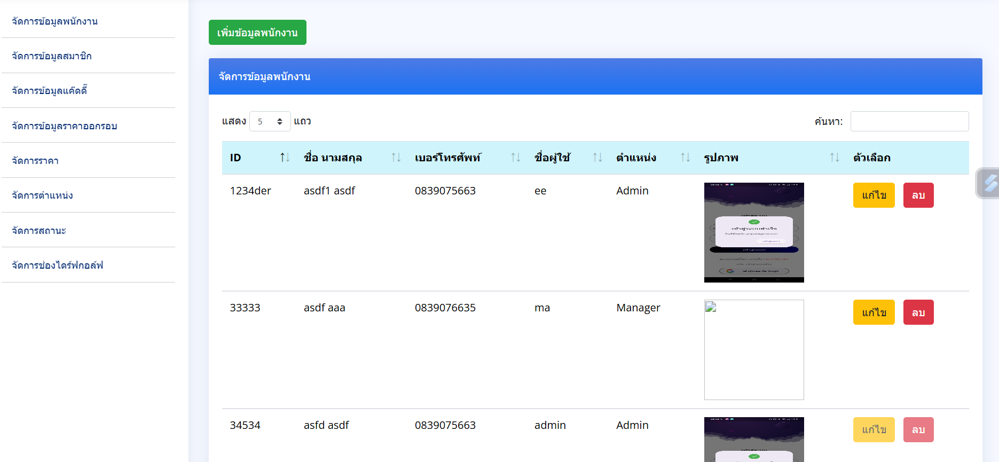
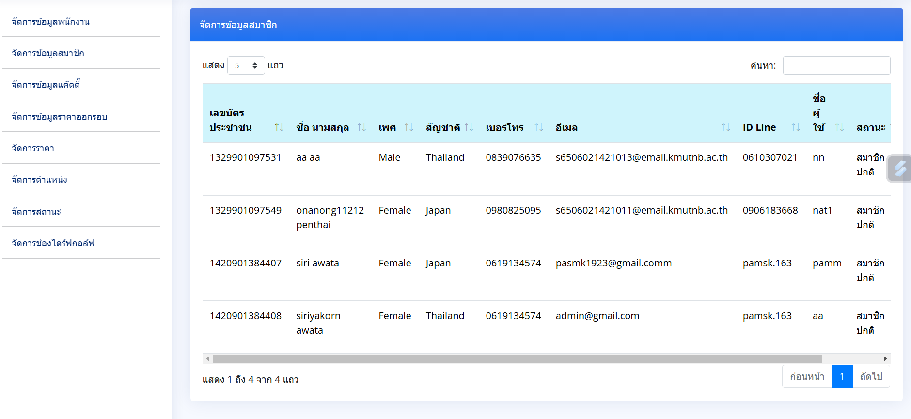
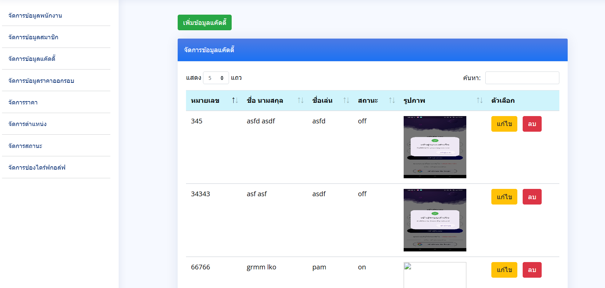
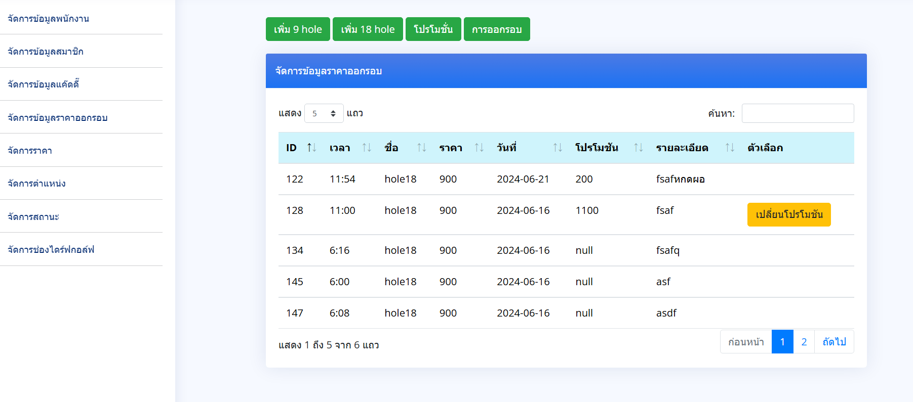
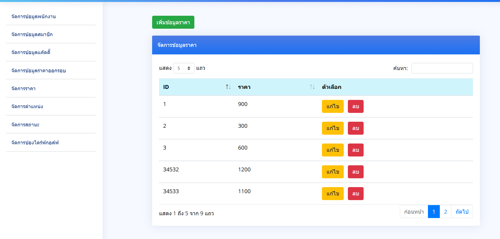
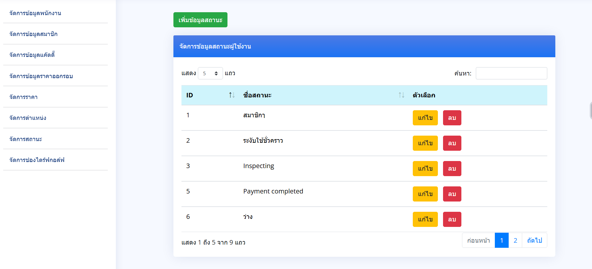
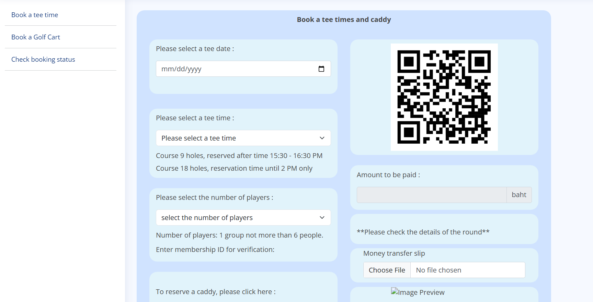
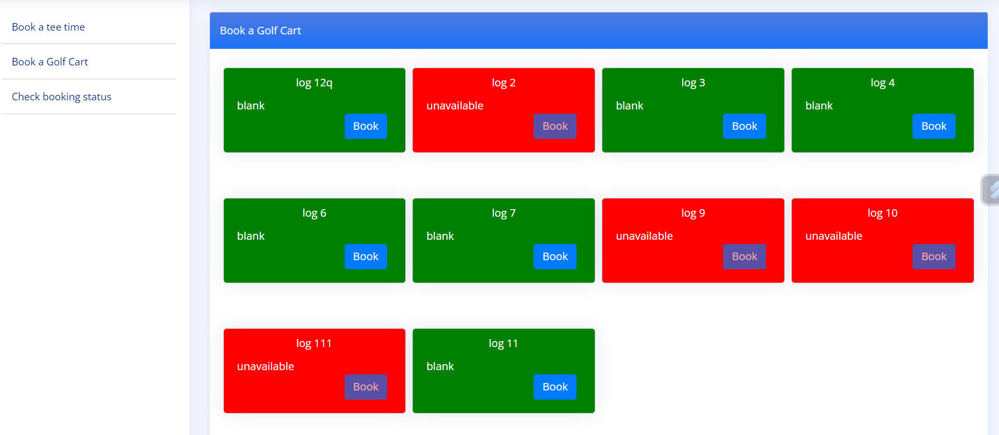

# Golf Course Management System  

## Overview  
ระบบนี้ออกแบบมาเพื่อรองรับการทำงานของ 4 กลุ่มผู้ใช้งานหลัก ได้แก่:  
1. **Admin (ผู้ดูแลระบบ):** จัดการข้อมูลหลักของระบบ  
2. **User (ผู้ใช้งาน):** จองเวลาเล่นกอล์ฟและตรวจสอบสถานะ  
3. **Cashier (แคชเชียร์):** จัดการการชำระเงินและรายงานการจอง  
4. **Manager (ผู้จัดการ):** ตรวจสอบรายงานการจอง  

---

## Features  

### 📋 **Admin Panel**  
1. **จัดการข้อมูลพนักงาน**  
2. **จัดการข้อมูลสมาชิก**  
3. **จัดการข้อมูลแค็ดดี้**  
4. **จัดการข้อมูลราคาคอร์ส**  
5. **จัดการราคา**  
6. **จัดการตำแหน่ง**  
7. **จัดการสถานะ**  
8. **จัดการช่องไดร์ฟกอล์ฟ**  

### 🏌️‍♂️ **User Panel**  
1. **Book a tee time** – จองเวลาเล่นกอล์ฟ  
2. **Book a Golf Cart** – จองรถกอล์ฟ  
3. **Check booking status** – ตรวจสอบสถานะการจอง  

### 💰 **Cashier Panel**  
1. **สถานะการจองและแจ้งเตือน** – ตรวจสอบและแจ้งเตือนสถานะการจอง  
2. **เช็คสถานะการชำระเงิน** – ตรวจสอบและยืนยันการชำระเงิน  
3. **รายงานการจอง** – สร้างรายงานสรุปข้อมูลการจอง  

### 📊 **Manager Panel**  
1. **ดูรายงานการจอง** – ตรวจสอบและวิเคราะห์ข้อมูลรายงานการจอง  

---

## Technologies Used  
- **Front-End:** HTML, CSS, JavaScript ,jquery
- **Back-End:** PHP 
- **Database:** MySQL 
- **UI Design:** Figma  

---

## Access  

| Panel            | URL                       | Default Credentials     |  
|------------------|---------------------------|-------------------------|  
| **Admin Panel**  | `http://localhost:3000/admin`   | Username: `admin` / Password: `admin` |  
| **User Panel**   | `http://localhost:3000/user`    | สมัครมาชิกใหม่หน้าเว็บได้เลย             

---

## รูปภาพตัวอย่าง

### Admin Panel  
<table>
  <tr>
    <td align="center"> <b>ภาพที่ 1</b></td>
    <td align="center"> <b>ภาพที่ 4</b></td>
  </tr>
  <tr>
    <td align="center"> <b>ภาพที่ 7</b></td>
    <td align="center"> <b>ภาพที่ 8</b></td>
  </tr>
  <tr>
    <td align="center"> <b>ภาพที่ 7</b></td>
    <td align="center"> <b>ภาพที่ 8</b></td>
  </tr>
</table>

### User Panel  
<table>
  <tr>
    <td align="center"> <b>ภาพที่ 1</b></td>
    <td align="center"> <b>ภาพที่ 4</b></td>
  </tr>
 
</table>

---

